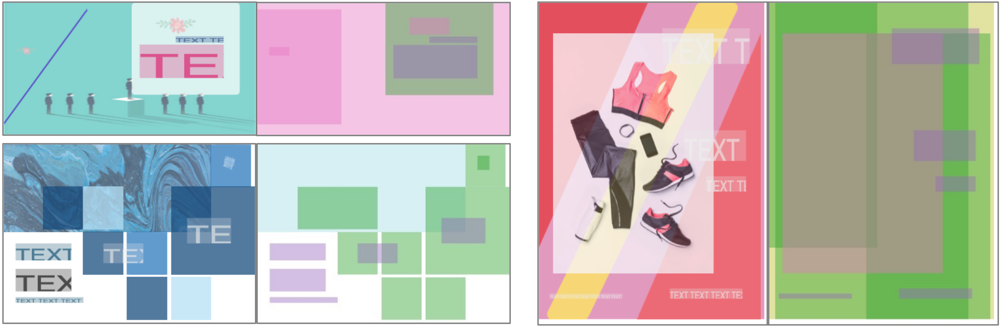

# Crello dataset

Crello dataset is compiled for the study of vector graphic documents. The
dataset contains document meta-data such as canvas size and pre-rendered
elements such as images or text boxes. The original templates was collected from
[crello.com](https://crello.com) (now [create.vista.com](https://create.vista.com))
and converted to low-resolution format suitable for machine learning analysis.



## Download

- [Crello dataset v2 release (3.9 GB)](https://storage.cloud.google.com/ailab-public/canvas-vae/crello-dataset-v2.zip)

## Content

- `README.md`: Text description of the dataset
- `train-*.tfrecord`: Training split
- `val-*.tfrecord`: Validation split
- `test-*.tfrecord`: Testing split
- `count.json`: Sample size of train, val, and test splits
- `vocabulary.json`: Vocabulary data for categorical attributes
- `LICENSE`: CDLA Permissive 2.0 license

## Data format

`(train-|val-|test-)*.tfrecord`

Document record stored in
[TFRecord format](https://www.tensorflow.org/tutorials/load_data/tfrecord),
which is a protocol buffer commonly used in Tensorflow.
Each of the `.tfrecord` file keeps serialized
[`tf.train.SequenceExample`](https://www.tensorflow.org/api_docs/python/tf/train/SequenceExample).
See the [python example below](#python-example) for how to parse them for
Tensorflow or convert to a generic python structure for other frameworks.
The schema is the following.

**Context features (Canvas attributes)**

| Field         | Type   | Shape | Description                                                    |
| ------------- | ------ | ----- | -------------------------------------------------------------- |
| id            | string | ()    | Template ID from crello.com                                    |
| group         | string | ()    | Broad design group, such as social media posts or blog headers |
| format        | string | ()    | Detailed design format, such as Instagram post or postcard     |
| category      | string | ()    | Topic category of the design, such as holiday celebration      |
| canvas_width  | int64  | ()    | Canvas pixel width                                             |
| canvas_height | int64  | ()    | Canvas pixel height                                            |
| length        | int64  | ()    | Length of sequence features                                    |

**Sequence features (Element attributes)**

| Field       | Type    | Shape | Description                                                          |
| ----------- | ------- | ----- | -------------------------------------------------------------------- |
| type        | string  | ()    | Element type, such as vector shape, image, or text                   |
| left        | float32 | ()    | Element left position normalized to [0, 1] range w.r.t. canvas_width |
| top         | float32 | ()    | Element top position normalized to [0, 1] range w.r.t. canvas_height |
| width       | float32 | ()    | Element width normalized to [0, 1] range w.r.t. canvas_width         |
| height      | float32 | ()    | Element height normalized to [0, 1] range w.r.t. canvas_height       |
| color       | int64   | (3,)  | Extracted main RGB color of the element                              |
| opacity     | float32 | ()    | Opacity in [0, 1] range                                              |
| image_bytes | string  | ()    | Pre-rendered 256x256 preview of the element encoded in PNG format    |
| text        | string  | ()    | Text content in UTF-8 encoding for text element                      |
| font        | string  | ()    | Font family name for text element                                    |
| font_size   | float32 | ()    | Font size (height) in pixels                                         |
| text_align  | string  | ()    | Horizontal text alignment, left, center, right for text element      |
| angle       | float32 | ()    | Element rotation angle (radian) w.r.t. the center of the element     |

Note that the color and pre-rendered images are do not necessarily accurately
reproduce the original design templates.
The original template is accessible at the following URL if still available.

```
https://create.vista.com/artboard/?template=<template_id>
```


`count.json`

Count of data splits.

```json
{
  "val": 2315,
  "train": 18768,
  "test": 2278
}
```

Note that due to the unstable hash issue, the counts are slightly different
from the ICCV 2021 paper in this dataset release.

`vocabulary.json`

Dictionaries of vocabulary-frequency for each string field in the dataset.

```js
{
  "canvas_height": {
    "1080": 3417,
    "1920": 2261,
    /* item-frequency pairs go on */
  },
  "canvas_width": {/* ... */},
  "category": {/* ... */},
  "format": {/* ... */},
  "group": {/* ... */},
  "font": {/* ... */},
  "text_align": {/* ... */},
  "type": {/* ... */}
}
```

## Python example

### Parsing

The following demonstrates how to convert TFRecord to generic python structure.

```python
import tensorflow as tf
from typing import Any, Dict

def extract_feature(feature: tf.train.Feature) -> Any:
    """Convert tf.train.Feature"""
    if feature.HasField("int64_list"):
        value = [x for x in feature.int64_list.value]
    elif feature.HasField("bytes_list"):
        value = [x for x in feature.bytes_list.value]
    elif feature.HasField("float_list"):
        value = [x for x in feature.float_list.value]
    else:
        raise ValueError("feature is empty")
    return value[0] if len(value) == 1 else value


def extract_sequence_example(serialized: bytes) -> Dict[str, Any]:
    """Parse and convert tf.train.SequenceExample"""
    example = tf.train.SequenceExample()
    example.ParseFromString(serialized)
    output = {}
    for key, feature in example.context.feature.items():
        output[key] = extract_feature(feature)
    for key, feature_list in example.feature_lists.feature_list.items():
        output[key] = [
            extract_feature(feature) for feature in feature_list.feature]
    return output


dataset = tf.data.Dataset.list_files("train-*.tfrecord")
dataset = tf.data.TFRecordDataset(dataset)
for example in dataset.take(1).as_numpy_iterator():
    example = extract_sequence_example(example)
    break

print(example)
```

Alternatively, the following approach can be used to extract specified fields.

```python
import tensorflow as tf
from typing import Any, Dict

def parse(serialized: bytes) -> Dict[str, tf.Tensor]:
    """Explicitly parse specified fields."""
    context, sequence, _ = tf.io.parse_sequence_example(
        serialized,
        context_features={
            "id": tf.io.FixedLenFeature((), tf.string),
            "group": tf.io.FixedLenFeature((), tf.string),
            "format": tf.io.FixedLenFeature((), tf.string),
            "category": tf.io.FixedLenFeature((), tf.string),
            "canvas_height": tf.io.FixedLenFeature((), tf.int64),
            "canvas_width": tf.io.FixedLenFeature((), tf.int64),
            "length": tf.io.FixedLenFeature((), tf.int64),
        },
        sequence_features={
            "type": tf.io.FixedLenSequenceFeature((), tf.string),
            "left": tf.io.FixedLenSequenceFeature((), tf.float32),
            "top": tf.io.FixedLenSequenceFeature((), tf.float32),
            "width": tf.io.FixedLenSequenceFeature((), tf.float32),
            "height": tf.io.FixedLenSequenceFeature((), tf.float32),
            "color": tf.io.FixedLenSequenceFeature((3,), tf.int64),
            "opacity": tf.io.FixedLenSequenceFeature((), tf.float32),
            "image_bytes": tf.io.FixedLenSequenceFeature((), tf.string),
            "text": tf.io.FixedLenSequenceFeature((), tf.string),
            "font": tf.io.FixedLenSequenceFeature((), tf.string),
            "font_size": tf.io.FixedLenSequenceFeature((), tf.float32),
            "text_align": tf.io.FixedLenSequenceFeature((), tf.string),
            "angle": tf.io.FixedLenSequenceFeature((), tf.float32),
        })
    return {**context, **sequence}


dataset = tf.data.Dataset.list_files("train-*.tfrecord")
dataset = tf.data.TFRecordDataset(dataset)
dataset = dataset.map(parse)

for example in dataset.take(1).as_numpy_iterator():
    break

print(example)
```

### Visualization

The parsed example can be visualized in the following approach. Note the
following does not guarantee the similar appearance to the original template.

```python
import io
import numpy as np
import skia
import tensorflow as tf
from typing import Any, Dict

def render(example: Dict[str, tf.Tensor], max_size: float=512.) -> bytes:
    """Render parsed sequence example onto an image and return as PNG bytes."""
    canvas_width = example["canvas_width"].numpy()
    canvas_height = example["canvas_height"].numpy()

    scale = min(1.0, max_size / canvas_width, max_size / canvas_height)

    surface = skia.Surface(int(scale * canvas_width), int(scale * canvas_height))
    with surface as canvas:
        canvas.scale(scale, scale)
        for index in range(example["length"].numpy()):
            with io.BytesIO(example["image_bytes"][index].numpy()) as f:
                image = skia.Image.open(f)
            left = example["left"][index].numpy() * canvas_width
            top = example["top"][index].numpy() * canvas_height
            width = example["width"][index].numpy() * canvas_width
            height = example["height"][index].numpy() * canvas_height
            rect = skia.Rect.MakeXYWH(left, top, width, height)

            angle = example["angle"][index].numpy()
            if angle != 0:
                degree = 180. * angle / np.pi
                canvas.save()
                canvas.rotate(degree, left + width / 2., top + height / 2.)

            canvas.drawImageRect(image, rect)
            if angle != 0:
                canvas.restore()

    image = surface.makeImageSnapshot()
    with io.BytesIO() as f:
        image.save(f, skia.kPNG)
        return f.getvalue()
```


## Citation

```
@article{yamaguchi2021canvasvae,
  title={CanvasVAE: Learning to Generate Vector Graphic Documents},
  author={Yamaguchi, Kota},
  journal={ICCV},
  year={2021}
}
```

## License

The origin of the dataset is [create.vista.com](https://create.vista.com) (formally, `crello.com`).
The distributor ("We") do not own the copyrights of the original design templates.
By using Crello dataset, the user of this dataset ("You") must agree to the
[VistaCreate License Agreements](https://create.vista.com/faq/legal/licensing/license_agreements/).

The dataset is distributed under [CDLA-Permissive-2.0 license](https://cdla.dev/permissive-2-0/).

**Note**

We do not re-distribute the original files as we are not allowed by terms.

## Versions

2.0: v2 release (May 26, 2022)

- Adds `text`, `font`, `font_size`, `text_align`, and `angle` sequence attributes.
- Include rendered text element in `image_bytes`.

1.0: v1 release (Aug 24, 2021)
